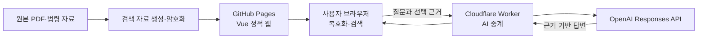

# 설비 근거검색 서비스 구조와 사용 안내

설비 근거검색은 기계설비 매뉴얼, 법령, KDS·KCS 자료를 한곳에서 검색하고, 선택된 근거를
바탕으로 AI 답변을 만들 수 있는 웹 서비스입니다.

## 서비스 주소

- 웹 서비스: <https://ygchoi77.github.io/mep-evidence-search/>
- 소스 저장소: <https://github.com/ygchoi77/mep-evidence-search>

## 제공 기능

1. 공유 비밀번호로 암호화 자료실에 접속합니다.
2. 설비 용어, 법령명, 조문 또는 KDS·KCS 코드로 자료를 검색합니다.
3. 검색 결과에서 PDF 해당 쪽과 공식 원문 링크를 확인합니다.
4. 관련도가 높은 검색 근거를 이용해 AI 보조 답변을 만듭니다.
5. AI 답변에 전달된 근거와 토큰 사용량을 확인합니다.

AI 답변은 설계 검토를 돕는 검색 보조 자료입니다. 최종 설계값, 적용 법령, 발주 조건과
관할 기관의 판단을 대신하지 않습니다.

## 전체 구조

서비스는 정적 웹 화면, 사용자의 브라우저, AI 중계 서버와 OpenAI API로 나뉩니다.

### GitHub Pages

Vue로 만든 검색 화면과 암호화된 검색 자료·PDF를 제공합니다. 정적 호스팅이므로 OpenAI API
비밀키를 저장하거나 서버 프로그램을 실행하지 않습니다.

### 사용자 브라우저

사용자가 입력한 공유 비밀번호로 암호화 자료를 브라우저 안에서 복호화합니다. 검색 역시
브라우저에서 수행합니다. 비밀번호, 복호화한 자료와 검색 기록은 브라우저 저장소에 영구
저장하지 않습니다.

### Cloudflare Worker

AI 질문 요청을 받는 중계 서버입니다. 요청 형식과 접속 권한을 확인하고 과도한 요청을 제한한
뒤 OpenAI API를 호출합니다. OpenAI API 비밀키는 웹 브라우저와 GitHub Pages에 전달하지
않습니다.

### OpenAI Responses API

사용자의 질문과 검색 결과 중 관련도가 높은 근거만 전달받아 답변을 생성합니다. 원본 PDF
전체를 보내지 않으며, 답변에는 `[근거 N]` 형식으로 사용한 근거 번호를 표시하도록 요청합니다.

## 데이터베이스를 사용하지 않는 이유

현재 서비스는 사용자 계정, 질문 이력 또는 실시간 공동 편집 기능이 필요하지 않기 때문에
별도 데이터베이스를 사용하지 않습니다.

검색에 필요한 자료를 미리 하나의 검색용 파일로 만들고, PDF와 함께 암호화해 배포합니다.
사용자가 접속하면 브라우저가 자료를 복호화하고 검색합니다. 이 구조는 정기적으로 확정된
자료를 갱신해 제공하는 서비스에 단순하고 적합합니다.

다음 기능이 필요해지면 인증 서버와 데이터베이스를 별도로 검토할 수 있습니다.

- 사용자별 계정과 권한
- 서버에 보관되는 질문·답변 이력
- 여러 운영자의 실시간 자료 관리
- 사용자별 사용량과 비용 관리

## 자료 보호 원칙

- 공개 저장소에는 암호화된 검색 자료와 PDF만 배포합니다.
- 공유 비밀번호와 API 비밀키는 소스 코드에 기록하지 않습니다.
- 공유 비밀번호는 서버로 전송하지 않습니다.
- 복호화한 검색 자료와 PDF는 브라우저 메모리에서 사용합니다.
- AI에는 관련도가 높은 검색 근거만 전달합니다.
- AI 답변과 검색 기록을 서비스 데이터베이스에 저장하지 않습니다.
- 공식 원문 링크는 HTTPS 주소만 사용합니다.

암호화 파일은 누구나 내려받을 수 있으므로 충분히 긴 공유 비밀번호를 사용해야 합니다. 공유
비밀번호가 유출된 것으로 의심되면 비밀번호를 교체하고 자료 전체를 다시 암호화해야 합니다.

## 검색 사용 방법

1. 웹 서비스에 접속합니다.
2. 전달받은 공유 비밀번호를 입력합니다.
3. 검색창에 질문, 설비 용어, 법령명 또는 기준 코드를 입력합니다.
4. 자료 종류와 확인 상태 필터를 이용해 결과를 좁힙니다.
5. 검색 결과에서 PDF 원문 또는 공식 원문을 확인합니다.
6. 사용을 마치면 `자료 잠금`을 누릅니다.

공용 PC에서는 사용 후 반드시 자료를 잠그고 브라우저 탭을 닫습니다.

## AI 답변 사용 방법

1. 먼저 검색창에 구체적인 질문을 입력합니다.
2. 화면에 표시된 검색 결과와 AI에 전달될 근거 수를 확인합니다.
3. API 이용료 안내를 읽고 확인란을 선택합니다.
4. `비용 발생 · AI 답변 생성`을 누릅니다.
5. 답변의 `[근거 N]`과 화면의 전달 근거가 일치하는지 확인합니다.
6. PDF와 공식 원문에서 중요한 내용을 다시 검토합니다.

단순 검색, 비밀번호 접속과 PDF 열기는 OpenAI API를 호출하지 않습니다. AI 답변 생성 버튼을
누를 때마다 별도 API 호출이 발생하며 사용한 모델과 토큰 수에 따라 비용이 발생할 수 있습니다.

## 배포 방식

| 대상 | 배포 방식 | 이유 |
|---|---|---|
| Vue 정적 화면 | GitHub Actions 자동 배포 | 비밀키를 사용하지 않는 정적 빌드 |
| 암호화 검색 자료 | 검증 후 GitHub Pages 배포 | 평문 자료의 공개 방지 |
| AI 중계 Worker | 테스트 후 수동 배포 | 비밀키와 API 비용에 영향을 주는 서버 코드 |

정적 화면과 AI 중계 서버의 배포를 분리해 화면 변경이 AI 서버에 직접 영향을 주지 않도록
구성했습니다.

## 비용 안내

서비스 운영에는 서로 다른 비용 체계가 적용됩니다.

- GitHub Pages: 정적 웹 화면과 암호화 파일 제공
- Cloudflare Workers: AI 중계 서버 실행과 로그
- OpenAI API: AI 질문의 입력·출력 토큰

Cloudflare 유료 플랜 요금에 OpenAI API 이용료는 포함되지 않습니다. 각 서비스의 사용량과
예산 알림을 별도로 확인해야 하며, 가격과 포함량은 변경될 수 있으므로 각 서비스의 공식
가격표를 기준으로 판단합니다.

## 현재 자료 범위

- 원문: 기계설비 기술기준 매뉴얼 2022년 5월판
- 현행화 기준일: 2026-07-17
- PDF: 466쪽
- 인용 위치: 1,310건
- 조문·기준 항목: 438건
- 법령·기준: 163종
- 검토 대상: 294건

`검토 필요` 항목에는 삭제·폐지, 내용 변경, 연결 신뢰도 부족, 전문 일부 수록 또는 기준 유형
변경 후보 등이 포함될 수 있습니다. 최종 적용 전 반드시 공식 원문을 확인합니다.

## 알려진 한계

- 공유 비밀번호 방식이므로 사용자별 권한을 회수할 수 없습니다.
- 암호화 파일에 대한 오프라인 비밀번호 대입 시도를 서버에서 차단할 수 없습니다.
- 검색 결과는 마지막 자료 갱신 시점의 스냅샷입니다.
- AI 답변은 제공된 근거가 부족하거나 오래되면 완전한 답을 만들 수 없습니다.
- AI 호출 제한은 비용 위험을 줄이는 장치이며 정확한 월 지출 상한은 아닙니다.
- 법률 판단, 설계 승인과 관할 기관의 해석을 자동화하지 않습니다.

## 공식 참고 문서

- [GitHub Pages 사용자 정의 Actions 배포](https://docs.github.com/en/pages/getting-started-with-github-pages/using-custom-workflows-with-github-pages)
- [Cloudflare Workers 개요](https://developers.cloudflare.com/workers/)
- [Cloudflare Workers 가격](https://developers.cloudflare.com/workers/platform/pricing/)
- [Cloudflare Workers 관측성](https://developers.cloudflare.com/workers/observability/)
- [OpenAI Responses API](https://developers.openai.com/api/reference/resources/responses/methods/create)

외부 서비스의 가격, 메뉴와 제한은 변경될 수 있습니다. 운영 설정을 바꿀 때는 공식 문서를
다시 확인합니다.
